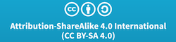

# Riguardo lo Standard

Benvenuti nel Mobile Application Security Verification Standard (MASVS). Il MASVS è uno strumento della comunità per stabilire un quadro di requisiti di sicurezza necessari per progettare, sviluppare e testare applicazioni mobili sicure su iOS e Android.

l MASVS è il risultato dell'impegno della comunità e del riscontro del settore. Ci aspettiamo che questo standard si evolva nel tempo e accogliamo con favore i feedback della comunità.

Il modo migliore per mettersi in contatto con noi è il canale Slack dell'OWASP Mobile Project: <https://owasp.slack.com/messages/project-mobile_omtg/details/> .

Gli account possono essere creati al seguente URL: [https://owasp.slack.com/join/shared_invite/zt-g398htpy-AZ40HOM1WUOZguJKbblqkw#/](https://owasp.slack.com/join/shared_invite/zt-g398htpy-AZ40HOM1WUOZguJKbblqkw#/).

## Copyright e License

Copyright © 2021 Fondazione OWASP. Questo lavoro è rilasciato sotto licenza [Creative Commons Attribution-ShareAlike 4.0 International License](https://creativecommons.org/licenses/by-sa/4.0/). Per qualsiasi riutilizzo o distribuzione, è necessario indicare chiaramente i termini della licenza di tale lavoro.

<!-- \pagebreak -->

## Riconoscimenti

| Responsabile del Progetto | Autore | Collaboratori e revisori
| ------- | --- | ----------------- |
| Sven Schleier and Carlos Holguera | Bernhard Mueller, Sven Schleier, Jeroen Willemsen and Carlos Holguera | Alexander Antukh, Mesheryakov Aleksey, Elderov Ali, Bachevsky Artem, Jeroen Beckers, Jon-Anthoney de Boer, Damien Clochard, Ben Cheney, Will Chilcutt, Stephen Corbiaux, Manuel Delgado, Ratchenko Denis, Ryan Dewhurst, @empty_jack, Ben Gardiner, Anton Glezman, Josh Grossman, Sjoerd Langkemper, Vinícius Henrique Marangoni, Martin Marsicano, Roberto Martelloni, @PierrickV, Julia Potapenko, Andrew Orobator, Mehrad Rafii, Javier Ruiz, Abhinav Sejpal, Stefaan Seys, Yogesh Sharma, Prabhant Singh, Nikhil Soni, Anant Shrivastava, Francesco Stillavato, Abdessamad Temmar, Pauchard Thomas, Lukasz Wierzbicki |

 

| Lingua | Traduttori & Revisori |
| --------------- | ------------------------------------------------------------ |
| Portoghese brasiliano | Mateus Polastro, Humberto Junior, Rodrigo Araujo, Maurício Ariza, Fernando Galves |
| Cinese (Tradizionale) | Peter Chi, Lex Chien, Henry Hu, Leo Wang |
| Cinese (Semplificato) | Bob Peng, Harold Zang, Jack S |
| Francese | Romuald Szkudlarek, Abderrahmane Aftahi, Christian Dong (Review) |
| Tedesco | Rocco Gränitz, Sven Schleier (Review) |
| Hindi | Mukesh Sharma, Ritesh Kumar, Kunwar Atul Singh, Parag Dave, Devendra Kumar Sinha, Vikrant Shah |
| Giapponese | Koki Takeyama, Riotaro Okada (Review) |
| Koreano | Youngjae Jeon, Jeongwon Cho, Jiyou Han, Jiyeon Sung |
| Persiano | Hamed Salimian, Ramin Atefinia, Dorna Azhirak, Bardiya Akbari, Mahsa Omidvar, Alireza Mazhari, Milad Khoshdel |
| Portoghese | Ana Filipa Mota, Fernando Nogueira, Filipa Gomes, Luis Fontes, Sónia Dias|
| Russo | Gall Maxim, Eugen Martynov, Chelnokov Vladislav, Oprya Egor, Tereshin Dmitry |
| Spagnolo | Martin Marsicano, Carlos Holguera |
| Turco | Anıl Baş, Haktan Emik |
| Greco | Panagiotis Yialouris |
| Italiano | Donato Di Pasquale |

Questo documento è nato come fork dell'OWASP Application Security Verification Standard scritto da Jim Manico.

### Donatori

Sebbene sia il MASVS che il MASTG siano creati e mantenuti dalla comunità su base volontaria, a volte è necessario un piccolo aiuto esterno. Ringraziamo quindi i nostri donatori per averci fornito i fondi necessari per assumere dei redattori tecnici. Si noti che la loro donazione non influenza in alcun modo il contenuto del MASVS o del MASTG. I pacchetti di donazione sono descritti nel sito [OWASP Project Wiki](https://www.owasp.org/index.php/OWASP_Mobile_Security_Testing_Guide#tab=Sponsorship_Packages "OWASP Mobile Application Security Testing Guide Donation Packages").

Vorremmo ringraziare tutti coloro che hanno acquistato il libro da [Leanpub](https://leanpub.com/mobile-security-testing-guide) e ci ha sponsorizzato in questo modo.
